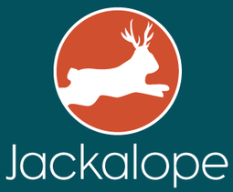

[](https://travis-ci.org/TWCable/jackalope)

[  ](https://bintray.com/twcable/aem/jackalope/_latestVersion)

## PURPOSE

Jackalope is an in-memory implementation of the JCR with stubbing capabilities for Apache Sling.

The goal of Jackalope is to better enable unit testing JCR representations of complex objects structures.
Java objects can normally be simply represented in the JCR as nodes with properties.

Simple mocking of the underlying JCR and Sling interfaces *can* be used to unit test reading and writing
these kinds of objects. However, when object aggregations like Sling component structures need to be
represented, the inability of simple mock objects to manage state become a real limitation.

The obvious solution is to use a JCR implementation that uses memory as its storage.
There are, in fact, memory-based JCR implementations -- including one that is distributed with the Jackrabbit project.
(Jackrabbit is the reference implementation for the JCR JSR.) All of these, however, require far too much in both
setup and resources to be useful for unit testing. They are designed to be long running, multi-threaded processes.

Our solution to this problem is to develop a simple and fast JCR implementation that can be used in unit tests.
It does not implement the complete JCR spec, such as locking, transactions, versioning, or search.
It does, however, support the basic facilities for reading and writing repository workspaces.

## Packages

The library is composed of 3 main packages.

### Builder (com.twcable.jackalope)

This is the primary interface that should be used by clients of the library.
The `JCRBuilder` class contains factory methods that can be used to create a virtual repository for use in test cases.

To bring this class's methods in, typically you would do:
```groovy
import static JCRBuilder.repostory
import static JCRBuilder.node
import static JCRBuilder.property
```

### Sling Implementation (com.twcable.jackalope.sling)

This package contains the classes that implement the primary Sling API classes like `Resource` and `ResourceResolver`.
Users may want to use `SimpleResourceResolverFactory` to inject into services and servlets.

### JCR Implementation (com.twcable.jackalope.jcr)

This package contains the classes that implement the primary JCR API classes like `Node` and `Property`.

## Examples

### Building and using a partial repository

```groovy
def repository = repository(
                     node("content",
                         node("test1",
                             node("callingrates",
                                 node("intl-direct-dial",
                                     property("sling:resourceType", "admin/components/content/callingratetable"),
                                     node("france",
                                         property("sling:resourceType", "admin/components/content/callingrate"),
                                         property("additional-minute-rate", "0.60"))))))).build()
def resolver = new SimpleResourceResolverFactory(repository).getAdministrativeResourceResolver()
def resource = resolver.getResource("/content/test1/callingrates/intl-direct-dial")

given:
def callingRateTable = new CallingRateTable(resource)

then:
callingRateTable.getRate("france")
callingRateTable.getRate("france").getAdditionalMinuteRate() == "0.60"
```

The resource resolver factory can be used to test servlets and services by injection.

```groovy
def repository = repository(
                     node("content",
                         node("test1",
                             node("callingrates",
                                 node("intl-direct-dial",
                                     property("sling:resourceType", "admin/components/content/callingratetable"),
                                     node("france",
                                         property("sling:resourceType", "admin/components/content/callingrate"),
                                         property("additional-minute-rate", "0.60"))))))).build()
def servlet = new CallingRatesImportServlet(new SimpleResourceResolverFactory(repository))
```

### Building and using a node tree

Some classes are designed to read and write node trees and do not require the full repository
implementation.  These classes can build and use nodes directly.

```groovy
def node = node("content",
               node("test1",
                   node("callingrates",
                       node("intl-direct-dial",
                           property("sling:resourceType", "admin/components/content/callingratetable"),
                           node("france",
                               property("sling:resourceType", "admin/components/content/callingrate"),
                               property("additional-minute-rate", "0.60"))))))).build()
```

### Returning a query result

Queries are also supported.  A JCRQueryBuilder is used to create a query manager that associates queries
with fixed result sets that can be used for testing.

```groovy
def node = node("result").build()
JCRQueryBuilder.queryManager(node.getSession(), query("query", "language", result(node))).build()

when:
def queryResult = node.getSession().getWorkspace().getQueryManager().createQuery("query", "language").execute()

then:
queryResult.getNodes().hasNext()

when:
def results = Lists.newArrayList(queryResult.getNodes())

then:
results[0] == node
```

## BUILDING

Jackalope uses gradle as its build system:

`./gradlew build`

# Including In Your Build

Jackalope can be used by including the following in your
build files (assuming Gradle):

```groovy
repositories {
  maven {
    url "http://dl.bintray.com/twcable/aem"
  }
}

testCompile 'com.twcable.jackalope:jackalope:2.0.0'
```

# LICENSE

Copyright 2015 Time Warner Cable, Inc.

Licensed under the Apache License, Version 2.0 (the "License"); you may not use this file except in compliance
with the License. You may obtain a copy of the License at

http://www.apache.org/licenses/LICENSE-2.0

Unless required by applicable law or agreed to in writing, software distributed under the License is distributed on
an "AS IS" BASIS, WITHOUT WARRANTIES OR CONDITIONS OF ANY KIND, either express or implied. See the License for
the specific language governing permissions and limitations under the License.
